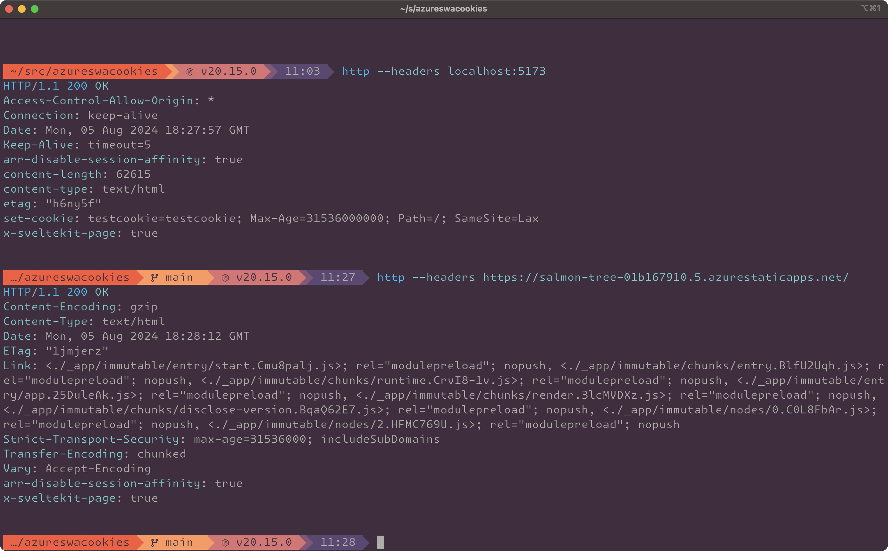

This repo is a minimal reproduction of the issue where Azure Static Webapps strips out cookies that are set.

It's probably related to this issue: https://github.com/Azure/static-web-apps/issues/760

To run locally: `pnpm install` and then `pnpm dev`

I've set this up to deploy to Azure SWA and you can see the difference between requests made to the local devserver:



Notice that in production, the `set-cookie` header is not included even though the `arr-disable-session-affinity` header is correctly passed through. Both are set in the same file. You can see in [src/hooks.server.ts](./src/hooks.server.ts):

```ts
export const handle: Handle = async ({ event, resolve }) => {
	event.setHeaders({ 'Arr-Disable-Session-Affinity': 'true' });
	event.cookies.set('testcookie', 'testcookie', {
		path: '/',
		maxAge: 31536000000,
		sameSite: "lax",
		httpOnly: false,
	});
	return await resolve(event);
};